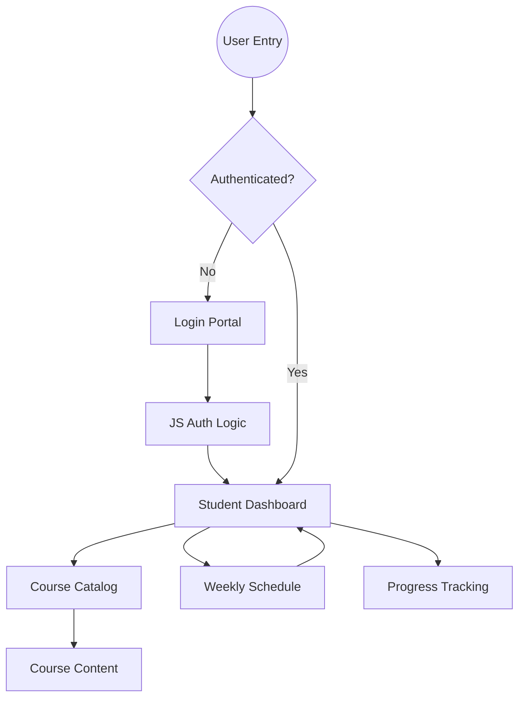

# RishiLearn — Future-Forward LMS


**RishiLearn** is a premium, high-fidelity Learning Management System (LMS) designed for the modern student. Featuring a futuristic "Cosmic Dark" aesthetic, it combines sleek glassmorphism with robust academic tracking tools to create an immersive educational experience.

---

## 🌌 Core Aesthetics & Design Philosophy

RishiLearn is built on a foundation of **Visual Excellence**. The platform utilizes:
- **Glassmorphic UI**: High-blur backdrops, subtle white borders, and semi-transparent layers.
- **Cosmic Theme**: A deep space palette with vibrant accents of `#8b5cf6` (Violet) and `#ec4899` (Pink).
- **Typography**: A curated pairing of **Syne** (for bold, futuristic headings) and **IBM Plex Mono** (for technical/code-like data points).
- **Interactive Micro-animations**: Hover-reactive cards, magnetic buttons, and animated progress rings.

---

## 🛠️ Technology Stack

- **Structure**: Semantic HTML5
- **Styling**: Vanilla CSS3 (Custom Design System)
- **Logic**: Vanilla JavaScript
- **Fonts**: Google Fonts (Syne, IBM Plex Mono, Inter)
- **Icons**: Custom SVG paths & Lucid-inspired iconography

---

## 🚀 Key Features

### 1. Unified Dashboard
A central hub for student activity featuring:
- **Attendance Tracker**: Visual radial chart showing progress across all subjects.
- **Upcoming Queue**: A timeline view of scheduled lessons and assignments.
- **Leaderboard**: A gamified ranking system based on XP (Experience Points).

### 2. Course Catalog
A comprehensive view of enrolled and available courses, organized in a sleek grid layout with urgency chips and progress indicators.

### 3. Interactive Time Table
A modern take on the classic schedule, allowing students to visualize their week at a glance with color-coded subject blocks.

### 4. Secure Authentication
A dedicated, themed login experience featuring 3D-effect orbs and a secure glassmorphic entry card.

---

## 📂 Project Structure

```text
Capstrone_1/
├── CSS/
│   ├── style.css         # Global design system & dashboard styles
│   ├── login.css         # Specific styles for the login portal
│   └── time-table.css    # Layout for the weekly schedule
├── JS/
│   └── login.js          # Authentication logic & UI interactions
├── index.html            # Landing Page / Main Hub
├── dashboard.html        # Student Dashboard
├── courses.html          # Course Overview & Management
├── login.html            # User Authentication Page
└── time-table.html       # Weekly Schedule View
```

---

## 🗺️ Project Plan


### User Flow Diagram



### Component Architecture

| Component | Responsibility | Tech Detail |
| :--- | :--- | :--- |
| **Navigation** | Global access to all modules | Glassmorphic floating header |
| **Hero Grid** | Real-time data visualization | CSS Grid & Radial SVGs |
| **Timeline** | Sequential event listing | Flexbox-based vertical list |
| **Leaderboard** | Social engagement/Gamification | Dynamic list with XP bars |
| **Attendance** | Academic status monitoring | Math-driven SVG stroke-dasharray |

---

## 📅 Roadmap & Milestones

### Phase 1: Foundation (Completed)
- [x] Design System Definition (Color Palette, Typography).
- [x] Core Layout Implementation (Navigation & Footer).
- [x] Responsive Grid System.

### Phase 2: Core Modules (Completed)
- [x] Dashboard Data Visualization (Attendance Radial).
- [x] Course Catalog Layout.
- [x] Weekly Time Table Component.
- [x] Authentication Portal.

### Phase 3: Interaction & Logic (In Progress)
- [ ] Dynamic Search Functionality.
- [ ] Profile Settings & Customization.
- [ ] Notification System.
- [ ] Real-time Attendance Updates.

---

## 🛠️ Technical Design Decisions

1. **Vanilla Stack**: Choosing HTML/CSS/JS without frameworks ensures maximum performance and cross-browser stability for this milestone.
2. **SVG-First Icons**: All iconography is implemented via SVGs to ensure crisp rendering at any scale and easy styling via CSS.
3. **Glassmorphism**: Utilizing `backdrop-filter: blur()` and semi-transparent borders to create a layered, modern depth.
4. **Mobile-Responsive**: Using a "desktop-first with mobile optimization" approach, ensuring the complex dashboard remains usable on smaller screens.

---

## 🛠️ Setup Instructions

1. **Clone the repository**:
   ```bash
   git clone [repository-url]
   ```
2. **Open the project**:
   Open the root folder in your preferred code editor (VS Code recommended).
3. **Run the application**:
   Open `index.html` in any modern browser (Chrome/Edge/Safari/Firefox).

---

